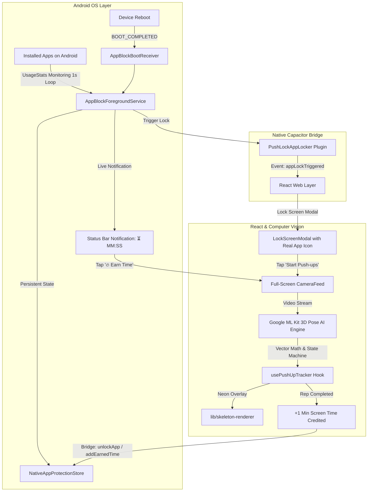

# 🔒 PushLock AI — AI-Powered Push-Up App Locker for Android

<div align="center">


**Transform physical exercise into earned screen time. Lock distracting apps and unlock them only by completing AI-verified, cheat-proof push-ups.**

[Features](#-key-features) • [Architecture](#-system-architecture) • [How It Works](#-how-it-works) • [Tech Stack](#-tech-stack) • [Installation & Build](#-build--installation-guide) • [Troubleshooting](#-troubleshooting)

</div>

---

## 🌟 Key Features

### 1. 🔒 Real Native Android App Locker
- **Physical Effort Gateway**: Target distracting apps (Instagram, YouTube, Games, Social Media) and lock them behind physical workouts.
- **Smart Active Screen-Time Ticker**:
  - Timer **only ticks down** while the user is actively using the unlocked app.
  - Timer **automatically pauses** when the user switches to the home screen or non-blocked apps.
  - Status bar notification and in-app dashboard stay **100% in sync to the exact second**.
- **Instant Interception & Overlay**: When screen-time quota reaches `00:00`, the app instantly displays the lock screen with the real high-res app icon.
- **Auto-Start on Boot**: `AppBlockBootReceiver` ensures background protection persists across device restarts.

### 2. 📲 Live Status Bar Countdown Notification
- **Ongoing Dynamic Notification**:
  - **In Blocked App**: `⏳ [App Name] Running: MM:SS` (Active Green Ticker)
  - **Paused / Home**: `Available Screen Time: MM:SS` (Cyan Status)
  - **Expired**: `🔒 Screen Time Expired (00:00)`
- **`[ 🔥 Earn Time (+Pushups) ]` Quick Action**: One-tap shortcut from anywhere in Android to immediately launch the workout camera.

### 3. 🏋️‍♂️ Ultra-Accurate 3D AI Push-Up Counter
- **3D Vector Dot Product Math**:
  $$\theta = \arccos\left(\frac{\vec{u} \cdot \vec{v}}{\|\vec{u}\| \|\vec{v}\|}\right) \times \frac{180}{\pi}$$
  Calculates biomechanical joint angles across $X, Y, Z$ depth planes, completely eliminating camera tilt distortion when the phone is on the floor or leaned against a wall.
- **Zero Missed Reps (Fast Push-Up Optimized)**:
  - Supports rapid, explosive push-ups (3–4 reps/sec).
  - Up Lockout threshold: $142.0^\circ$
  - Down Depth threshold: $98.0^\circ$ (Instant 1-frame bottom depth registration)
  - Minimum rep duration: $140\text{ ms}$
  - Anti-jitter debounce cooldown: $60\text{ ms}$
- **Anti-Cheat Validation**: Enforces straight spine posture ($\ge 130.0^\circ$) to prevent head-nodding or waist-bending cheats.

### 4. 🎨 Neon Skeleton Visualizer & Voice Coach
- **Glowing Neon Skeleton Overlay**:
  - **Neon Green (`#34C759`)**: Full depth reached ($\le 98^\circ$).
  - **Electric Cyan (`#00E5FF`)**: Ready in plank position.
  - **Coral Red (`#FF3B30`)**: Sagging back or invalid form.
  - Glowing joint halos ($14\text{px}$) with crisp white inner cores ($7\text{px}$).
- **Real-Time Voice Coach**: Built-in Android Text-To-Speech (TTS) rep announcements and audible posture guidance.

---

## 🏗️ System Architecture



---

## 📱 How It Works

1. **Select Apps to Protect**: Open PushLock AI and choose any installed apps to lock (e.g. YouTube, Instagram).
2. **Launch a Protected App**:
   - PushLock AI intercepts the launch and shows: *"Complete push-ups to unlock"*.
3. **Perform Push-ups with AI Camera**:
   - Place your phone on the floor or lean it against a wall.
   - The AI tracks your shoulders, elbows, hips, knees, and spine in real-time 3D.
   - Real-time glowing skeleton provides visual depth and form feedback.
4. **Earn Screen Time**:
   - Each completed push-up adds **1 minute** (customizable) of screen time.
   - The app unlocks immediately.
5. **Smart Usage Deduction**:
   - Status bar shows a live countdown while using the app.
   - When you close the app, the countdown **pauses**.
   - When time hits `00:00`, the app locks automatically.

---

## 🛠️ Tech Stack

| Layer | Technologies |
|---|---|
| **Mobile Native Layer** | Android SDK, Kotlin, Java, Foreground Service, UsageStatsManager, BroadcastReceiver, SharedPreferences |
| **Hybrid Bridge** | Capacitor v7, Custom Native Capacitor Plugins (`PushLockAppLockerPlugin`) |
| **Frontend Framework** | Next.js 15 (App Router), React 19, TypeScript, Tailwind CSS, Lucide Icons |
| **Computer Vision & AI** | Google ML Kit Pose Detection (Accurate Float-16 Models), MediaPipe Pose, 3D Vector Math Engine |
| **Audio & Speech** | Android Text-To-Speech (TTS), Web Audio API Synth Engine |

---

## 📂 Project Directory Structure

```
ai-push-up-counter/
├── android/                                    # Android Native Project
│   ├── app/
│   │   ├── src/main/
│   │   │   ├── AndroidManifest.xml             # Foreground service & permissions
│   │   │   ├── assets/
│   │   │   │   └── mlkit_pose/                 # Bundled Float-16 TFLite models
│   │   │   └── java/com/pushlock/ai/
│   │   │       ├── MainActivity.java           # Entry activity & navigation routing
│   │   │       ├── blocker/
│   │   │       │   └── AppBlockerManager.kt    # Quota store & permission helpers
│   │   │       ├── service/
│   │   │       │   ├── AppBlockForegroundService.kt # 1s usage ticker & live notification
│   │   │       │   └── PushLockAccessibilityService.kt
│   │   │       ├── receiver/
│   │   │       │   └── AppBlockBootReceiver.kt # Auto-start on reboot
│   │   │       ├── plugin/
│   │   │       │   └── PushLockAppLockerPlugin.kt # Capacitor native bridge
│   │   │       └── storage/
│   │   │           └── NativeAppProtectionStore.kt # Persistent single source of truth
├── app/                                        # Next.js App Router
│   ├── page.tsx                                # Main application router & state
│   └── layout.tsx
├── components/                                 # React UI Components
│   ├── ActiveTimersCard.tsx                    # Active session countdown card
│   ├── AppLockerView.tsx                       # Installed app selector & protection toggle
│   ├── CameraFeed.tsx                          # Full-screen workout camera
│   ├── LockScreenModal.tsx                     # Instant lock modal with real app icon
│   └── ProtectionSetupView.tsx                 # Permission onboarding guide
├── hooks/                                      # React Hooks
│   ├── usePushUpTracker.ts                     # 4-state machine & fast rep counter
│   └── usePoseDetector.ts                     # Video frame processor & camera controller
├── lib/                                        # Core AI & Utility Libraries
│   ├── pose-math.ts                            # 3D Vector Dot Product angle calculations
│   ├── skeleton-renderer.ts                    # Bold neon glowing skeleton visualizer
│   └── native-bridge/
│       └── androidAppLocker.ts                 # TypeScript native bridge client
└── package.json
```

---

## 🚀 Build & Installation Guide

### Prerequisites
- **Node.js**: v18+ or v20+
- **JDK**: Java Development Kit 17 or 21 (`export JAVA_HOME=...`)
- **Android SDK & Build Tools**: Android SDK Platform 34 / 35
- **Android Device**: Android 8.0 (API level 26) or higher

---

### Step 1: Install Dependencies
```bash
npm install
```

### Step 2: Build Web Application
```bash
npm run build
```

### Step 3: Synchronize with Capacitor Android
```bash
npx cap sync android
```

### Step 4: Build Native Android APK
```bash
cd android
./gradlew assembleDebug
```
The compiled debug APK will be generated at:
```
android/app/build/outputs/apk/debug/app-debug.apk
```

### Step 5: Install APK on Android Device via ADB
```bash
adb install -r app/build/outputs/apk/debug/app-debug.apk
```
*Or open the `android` folder in **Android Studio** and click **Run (Shift + F10)**.*

---

## 🔐 Required Android Permissions

When launching the app for the first time, PushLock AI will prompt for the following standard Android permissions:

1. **Camera (`android.permission.CAMERA`)**: Required for real-time AI push-up pose tracking.
2. **Usage Access (`PACKAGE_USAGE_STATS`)**: Required by the foreground service to detect when a protected app is in the foreground.
3. **Display Over Other Apps (`SYSTEM_ALERT_WINDOW`)**: Required to display the lock overlay over restricted apps.
4. **Notifications (`POST_NOTIFICATIONS`)**: Required for the live status bar countdown timer and quick workout action.
5. **Battery Optimization Exemption**: Required to ensure the background protection service is not killed by aggressive OEM battery managers (Xiaomi, OnePlus, Samsung, Oppo).

---

## 🔧 Troubleshooting

### 1. Timer difference between Status Bar and App
- Ensure you are on the latest build where `ActiveTimersCard` reads `remainingSeconds` directly from `NativeAppProtectionStore`.

### 2. Fast push-ups not counting
- The app uses an optimized $140\text{ ms}$ minimum rep duration and $142^\circ / 98^\circ$ thresholds. Ensure your full upper body and hips are visible in the camera frame.

### 3. Background Service Killed by OEM (Xiaomi / Vivo / Oppo / Realme)
- Go to your phone's **Settings $\rightarrow$ Apps $\rightarrow$ PushLock AI**:
  - Enable **Autostart / Background Auto-start**.
  - Set Battery Saver to **No Restrictions**.

---

## 📄 License
This project is licensed under the MIT License — see the [LICENSE](LICENSE) file for details.
